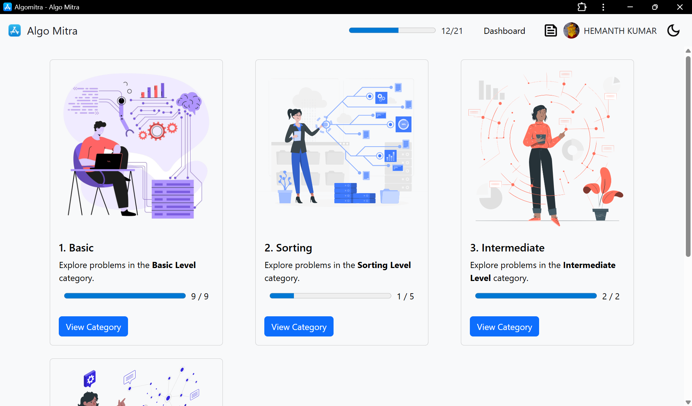
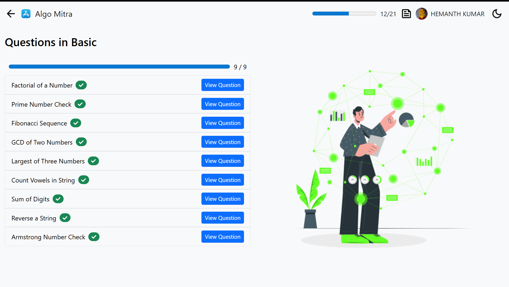
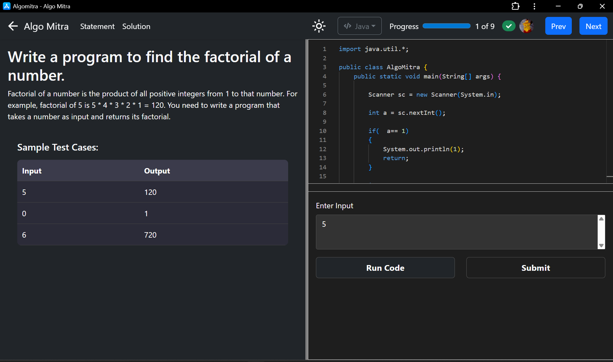

# 📦 AlgoCore

A modern and responsive web application built using **React**. This project demonstrates component-based architecture, reusable UI elements, and best practices in front-end development.

## 🚀 Demo

[Live Demo](https://hemanthkumarannam.github.io/Algo-Mitra/profile)

## 📸 Screenshots

| Home Page | Dashboard |
|-----------|-----------|
|  |  |
| Problem Page | Problem Page |
|-----------|-----------|
|  |  |

## 🧰 Tech Stack

- ⚛️ React
- 🧱 HTML5 + CSS3
- 🌀 Bootstrap


## ✅ Features

- 🔥 Responsive design
- 🔍 Search and filter functionality
- 🔐 Authentication (Login/Register)
- 🎨 Theming support (Light/Dark mode)
- 🧭 Routing with React Router
- 📦 API integration
- 🧪 Unit/Component Testing

## 🛠️ Getting Started

### Prerequisites

- Node.js (>= 14.x)
- npm or yarn


### File Struture

- AlgoMitra/
- ├── .gitignore
- ├── package-lock.json
- ├── package.json
- ├── README.md
- ├── public/
- │   ├── 404.html
- │   ├── favicon.ico
- │   ├── icon.png
- │   ├── index.html
- │   ├── logo.png
- │   ├── manifest.json
- │   └── robots.txt
- └── src/
-    ├── api.js
-    ├── App.js
-    ├── App.test.js
-    ├── constants.js
-    ├── cryptoUtils.js
-    ├── ErrorBoundary.js
-    ├── firebase.js
-    ├── index.css
-    ├── index.js
-    ├── ProtectedRoute.js
-    ├── reportWebVitals.js
-    ├── setupTests.js
-    ├── account/
-    │   ├── Dashboard.js
-    │   └── Profile.js
-    ├── pages/
-    │   ├── CategoryPage.js
-    │   ├── Dashboard.js
-    │   ├── ExamAdmin.js
-    │   ├── Home.js
-    │   ├── Problem.js
-    │   ├── TestWindow.js
-    │   └── Tests.js
-    └── ui/
-    |    ├── CodeEditor.js
-    |    ├── ConsoleOutput.js
-    |    ├── Header.js
-    |    ├── Login.js
-    |    ├── OutputBox.js
-    |    ├── QuestionPanel.js
-    |    └── Signup.js


### Installation

```bash
git clone https://github.com/hemanthkumarannam/AlgoMitra.git
cd AlgoMitra
npm install
# or
yarn install

